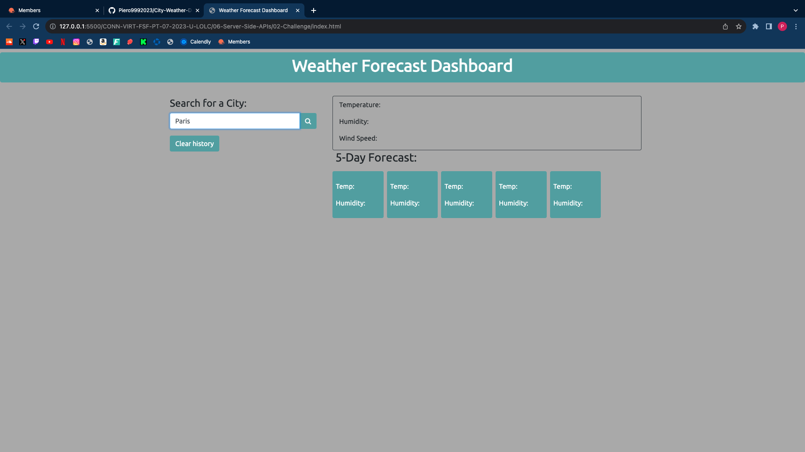
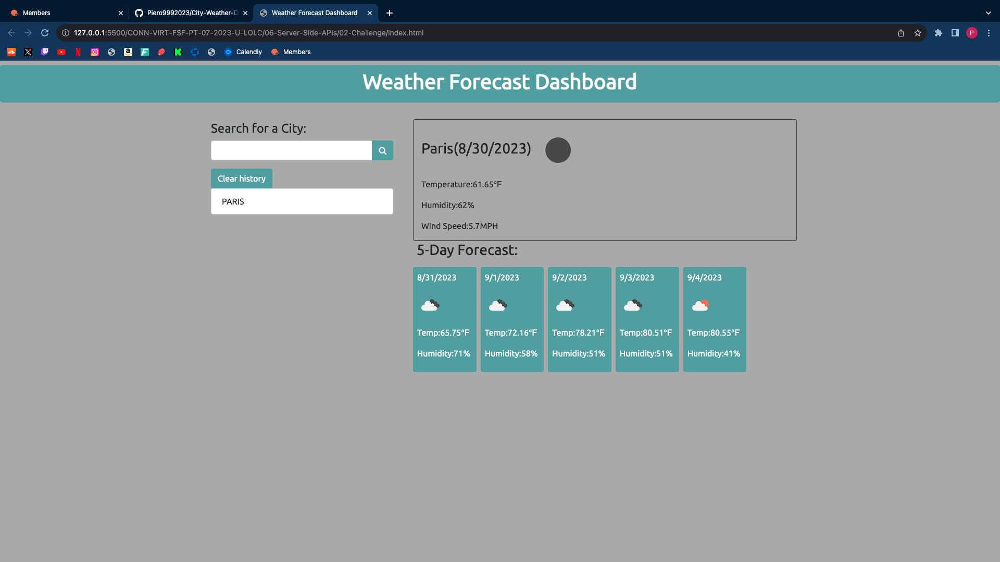
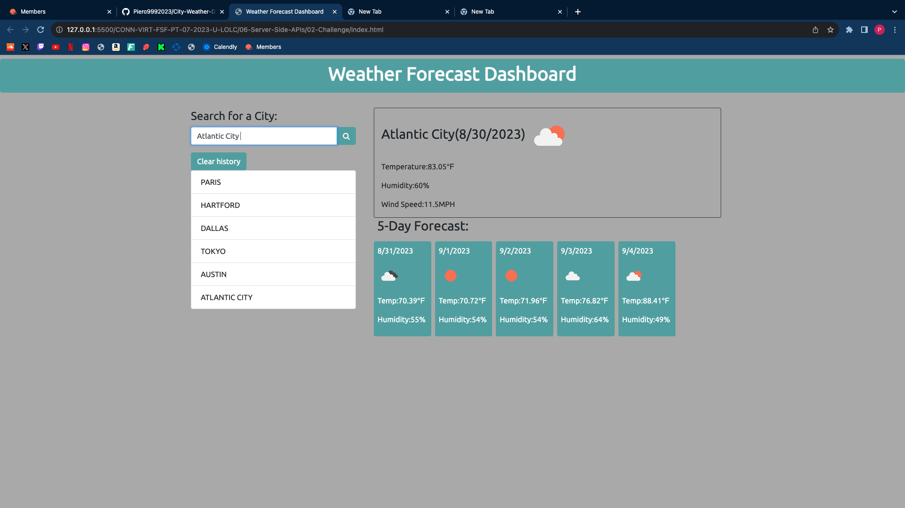
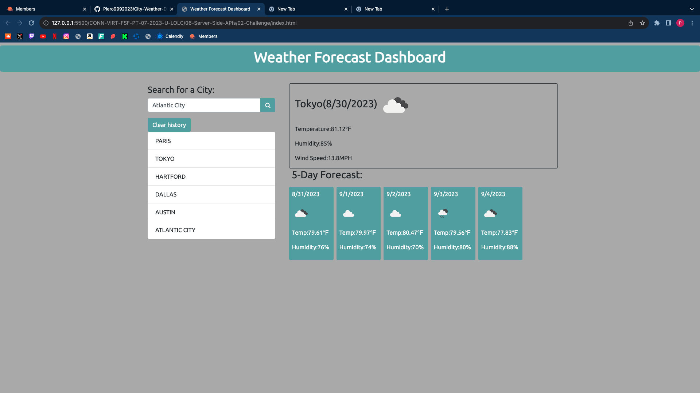
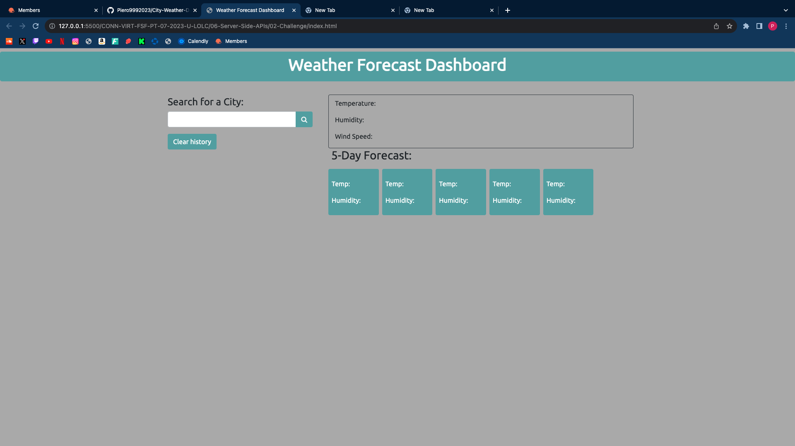

# City-Weather-Dashboard

## Description 
My motviation to do this project was to sucessfully create a fully funcional weather website/app for the travelers that might come in need of knowing the current weather and the a 5 day forecast of a specific city anywhere in the world. I built this project so that travelers or even any user know what the weather. My website create an efficent way for people to search a city and instantly get the weather for the current day and also get the weather forecast the next 5 days. The problem my website solves is guessing whether the weather is going to be nice or bad; the webisite I have created solves this problem by having instant data for the weather in a city so that the user/traveler is aware of the weather, This way the weather can't ruin any future plans of the user/traveler. I have learned many new things along the way. One of the most important things I have learned where how to do an AJAX call from javascript, how to convert the temperature from Kevlin to farenheit, how to use the API documentation, and also include a variable inside a quotation marks. I've had a little bit of a better understading of these concepts when I reasearched in MDN.  

## Installtion

The steps required was to firstly build out all the of the html with the help of bootstrap. Completing the html with bootstrap made a clear layout of what to move onto next. The next step was to add a little bit more styling with CSS. The third step was to start on the Javascript. There were a lot of challeneges I have faced doing the javascript. One of the biggest challenges were how to make the history pop up under the search bar when the user searched a city. In the javascript I have started out with declaring varaibles for buttons and for the weather data. Next was to include a function to make sure the city that was searched does exist. Then I have created an AJAX call in order to fetch data from the API. Then I have inserted the date (with the help of MDN) for when the city is searched. The next step was to insert the display all the weather data with Jquery. Next was to do local storage to make sure the past seaches of the user have been stored. Then I had to create a function to shows the weather forecast for the next 5 days. Then I had to create the function to add the past searched onto the list under the search button. The next step was  to make sure the last past city weather forecast work when clicked from the history list. Next was to create a fucntion to make sure the clear history button does work so that when the user clicks the button all their past seaches will be removed. The last step was to crea the eventListeners for all the function that were created. I had to also makes the little icons in the weather boxes fit matched with the data that is presented to the traveler.  

## Usage 
1. The first step would be for the traveler to insert the name of the city they plan on going to inside the white search bar.

2. The next step is for the traveler to press the magnifying glass next to the search bar. Once the magnifying glasss is clicked the current weather forecast and also the weather forecast for the next five days will appear. Their city search will be added to the history list.

3. As the user searches for more and more cities each city the user has seached for will appear in the history list under the search bar. 

4. If and when the user decides to revisit past search they can just click the city (from their history list) they wish to recheck the weather for and they will be brought to the weather forecast for that past city. 

5. When the user wishes to clear their search history they can just click on the "clear history" button found beneath the search bar.

## Credits 
Made by Piero Rodriguez 

